# WEEX Rust SDK

<div align="center">


[](https://crates.io/crates/weex_rust_sdk)
[](https://docs.rs/weex_rust_sdk)
[](LICENSE)

**Production-Grade Rust SDK for WEEX Exchange**

*Full AI Wars API Coverage • Async/Await • Type-Safe*

[Installation](#-installation) • [Quick Start](#-quick-start) • [API Reference](#-api-reference) • [Examples](#-examples) • [Contributing](#-contributing)

</div>

---

## 🎯 Overview

The official Rust SDK for [WEEX Exchange](https://www.weex.com/), providing complete API coverage for spot trading, futures, and the AI Wars competition. Built with async/await for high performance and type safety.

### Key Features

| Feature | Description |
|---------|-------------|
| 🚀 **Async/Await** | Built on Tokio for high-performance async operations |
| 🔐 **Secure Auth** | HMAC-SHA256 signing with automatic header generation |
| 📊 **Full API Coverage** | 45+ endpoints for Market, Account, and Trade APIs |
| 🤖 **AI Wars Ready** | Built-in AI Log upload for competition compliance |
| 🛡️ **Type Safe** | Strongly typed requests and responses |
| ⚡ **Rate Limiting** | Built-in rate limiter to prevent API throttling |
| 🔄 **Retry Logic** | Automatic retry with exponential backoff |

## 🏗️ Architecture


## 📦 Installation

Add to your `Cargo.toml`:

```toml
[dependencies]
weex_rust_sdk = "0.6"
tokio = { version = "1", features = ["full"] }
```

Or install via cargo:

```bash
cargo add weex_rust_sdk tokio --features tokio/full
```

## 🚀 Quick Start

```rust
use weex_rust_sdk::WeexClient;

#[tokio::main]
async fn main() -> Result<(), Box<dyn std::error::Error>> {
    // Create client
    let client = WeexClient::builder()
        .base_url("https://api-contract.weex.com")
        .api_key("your_api_key")
        .secret_key("your_secret_key")
        .passphrase("your_passphrase")
        .build()?;

    // Get BTC ticker
    let ticker = client.get_ticker("cmt_btcusdt").await?;
    println!("BTC Price: ${}", ticker.last);

    // Get account assets
    let assets = client.get_assets().await?;
    println!("Balance: {}", assets);

    Ok(())
}
```

## 📊 API Coverage

### Market Data (Public)

```mermaid
flowchart LR
    subgraph Market["📊 Market Endpoints"]
        T[get_ticker]
        AT[get_all_tickers]
        D[get_depth]
        K[get_klines]
        TR[get_trades]
        C[get_contracts]
        FR[get_funding_rate]
        OI[get_open_interest]
    end
```



| Method | Endpoint | Description |
|--------|----------|-------------|
| `get_server_time()` | `/capi/v2/market/time` | Server timestamp |
| `get_contracts()` | `/capi/v2/market/contracts` | Contract info |
| `get_ticker(symbol)` | `/capi/v2/market/ticker` | Single ticker |
| `get_all_tickers()` | `/capi/v2/market/tickers` | All tickers |
| `get_depth(symbol)` | `/capi/v2/market/depth` | Orderbook |
| `get_klines(symbol, interval)` | `/capi/v2/market/candles` | Candlesticks |
| `get_trades(symbol)` | `/capi/v2/market/trades` | Recent trades |
| `get_funding_rate(symbol)` | `/capi/v2/market/fundingRate` | Funding rate |
| `get_open_interest(symbol)` | `/capi/v2/market/openInterest` | Open interest |

### Account (Authenticated)

```mermaid
flowchart LR
    subgraph Account["🔐 Account Endpoints"]
        A[get_assets]
        P[get_positions]
        B[get_bills]
        L[set_leverage]
        M[set_margin_mode]
    end
```



| Method | Endpoint | Description |
|--------|----------|-------------|
| `get_assets()` | `/capi/v2/account/assets` | Account balance |
| `get_position(symbol)` | `/capi/v2/account/position/singlePosition` | Single position |
| `get_all_positions()` | `/capi/v2/account/position/allPosition` | All positions |
| `get_bills(symbol)` | `/capi/v2/account/bills` | Account ledger |
| `set_leverage(symbol, leverage)` | `/capi/v2/account/leverage` | Set leverage |
| `set_margin_mode(symbol, mode)` | `/capi/v2/account/setMarginMode` | Margin mode |
| `adjust_margin(symbol, amount)` | `/capi/v2/account/adjustPositionMargin` | Adjust margin |

### Trading (Authenticated)

```mermaid
flowchart LR
    subgraph Trade["⚡ Trade Endpoints"]
        PO[place_futures_order]
        CO[cancel_futures_order]
        CA[cancel_all_orders]
        TO[place_trigger_order]
        TP[place_tpsl]
    end
```



| Method | Endpoint | Description |
|--------|----------|-------------|
| `place_futures_order(...)` | `/capi/v2/order/placeOrder` | Place order |
| `cancel_futures_order(...)` | `/capi/v2/order/cancelOrder` | Cancel order |
| `cancel_all_orders(symbol)` | `/capi/v2/order/cancelAllOrders` | Cancel all |
| `get_order_detail(...)` | `/capi/v2/order/detail` | Order info |
| `get_order_history(symbol)` | `/capi/v2/order/history` | Order history |
| `get_current_orders(symbol)` | `/capi/v2/order/current` | Open orders |
| `get_fills(symbol)` | `/capi/v2/order/fills` | Trade fills |
| `place_trigger_order(...)` | `/capi/v2/order/placeTriggerOrder` | Trigger order |
| `place_tpsl(...)` | `/capi/v2/order/placeTPSL` | TP/SL order |
| `close_all_positions(symbol)` | `/capi/v2/order/closeAllPositions` | Close all |

### AI Wars (Competition)


| Method | Endpoint | Description |
|--------|----------|-------------|
| `upload_ai_log(...)` | `/capi/v2/order/uploadAiLog` | Upload AI reasoning log |

## 📖 Examples

### Placing a Market Order

```rust
use weex_rust_sdk::{WeexClient, Side, OrderType};

async fn place_order(client: &WeexClient) -> Result<(), Box<dyn std::error::Error>> {
    let result = client.place_futures_order(
        "cmt_btcusdt",
        "0.001",
        Side::Buy,
        OrderType::Market,
        None,            // price (not needed for market)
        Some("my_order_123"),  // client order id
    ).await?;
    
    println!("Order placed: {}", result);
    Ok(())
}
```

### Uploading AI Log

```rust
use weex_rust_sdk::WeexClient;
use serde_json::json;

async fn upload_ai_log(client: &WeexClient) -> Result<(), Box<dyn std::error::Error>> {
    let result = client.upload_ai_log(
        Some(12345),  // order_id (optional)
        "Strategy Generation",
        "gpt-5.2",
        json!({"market_data": {"price": 88000, "rsi": 45}}),
        json!({"signal": "BUY", "confidence": 0.85}),
        "RSI indicates oversold conditions with bullish divergence."
    ).await?;
    
    println!("AI Log uploaded: {}", result);
    Ok(())
}
```

### Error Handling

```rust
use weex_rust_sdk::{WeexClient, WeexError};

async fn safe_request(client: &WeexClient) {
    match client.get_ticker("cmt_btcusdt").await {
        Ok(ticker) => println!("Price: {}", ticker.last),
        Err(WeexError::Api { code, msg }) => {
            eprintln!("API Error {}: {}", code, msg);
        }
        Err(WeexError::Network(e)) => {
            eprintln!("Network error: {}", e);
        }
        Err(e) => eprintln!("Other error: {:?}", e),
    }
}
```

## 🔧 Configuration

### Builder Options

```rust
let client = WeexClient::builder()
    .base_url("https://api-contract.weex.com")  // Required
    .api_key("your_key")                        // Required
    .secret_key("your_secret")                  // Required
    .passphrase("your_passphrase")              // Required
    .timeout(Duration::from_secs(30))           // Optional
    .build()?;
```

## 📐 Type Reference

```rust
use weex_rust_sdk::{
    // Core
    WeexClient,
    WeexClientBuilder,
    WeexError,
    
    // Types
    Side,           // Buy, Sell
    OrderType,      // Limit, Market, Trigger
    TimeInForce,    // Gtc, Ioc, Fok
    MarginMode,     // Crossed, Isolated
    PositionSide,   // Long, Short
    TriggerType,    // FillPrice, MarkPrice
    AILogStage,     // StrategyGeneration, DecisionMaking, etc.
};
```

## 🏆 AI Wars Competition

This SDK is fully compatible with the WEEX AI Wars hackathon requirements:

- ✅ All required API endpoints implemented
- ✅ AI Log upload for competition compliance
- ✅ Maximum 20x leverage support
- ✅ All allowed trading pairs supported

## 🤝 Contributing

We welcome contributions! Please see [CONTRIBUTING.md](CONTRIBUTING.md) for guidelines.

```bash
# Clone
git clone https://github.com/Miny-Labs/weex-rust-sdk.git

# Build
cargo build

# Test
cargo test

# Run examples
cargo run --example full_test
```

## 📜 License

MIT License - see [LICENSE](LICENSE) for details.

## 🔗 Related

- [Fenyr AI Agent](https://github.com/Miny-Labs/fenyr-trading-agent) - GPT-5.2 trading bot using this SDK
- [WEEX Exchange](https://www.weex.com/) - Official exchange website
- [API Documentation](https://www.weex.com/support/apiGuide) - Official API docs

---

<div align="center">

**Made with 🦀 by [Miny Labs](https://github.com/Miny-Labs)**

[](https://crates.io/crates/weex_rust_sdk)

</div>
